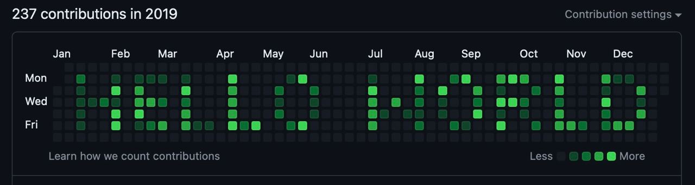

# banner-writer

<h2>
    Make a unique banner in your Github!
</h2> 
<p align="center">
    
</p>

Requirements:
1. Installed git
2. Installed docker

Steps:
1. Clone the repository:
```
git clone https://github.com/antonT001/banner-writer.git
```
2. Go to directory banner-writer:
```
cd banner-writer
```
3. Edit the .env file, specify the year to create the banner and the banner text
4. Run the make rule docker/run:
```
make docker/run
```
5. Wait for the process to complete
6. Create a public repository at https://github.com
7. Add the remote repository to a project on your computer

example: ```git remote add origin https://github.com/antonT001/hello-world.git```

8. Push the project to the remote repository:
```
git push -u origin master
```
9. Check the result

<h2>
    Quick video tutorial:
</h2> 
https://github.com/antonT001/banner-writer/assets/102325100/1c899658-ba40-414e-9c86-4bc8bd9ed7a4


##############
